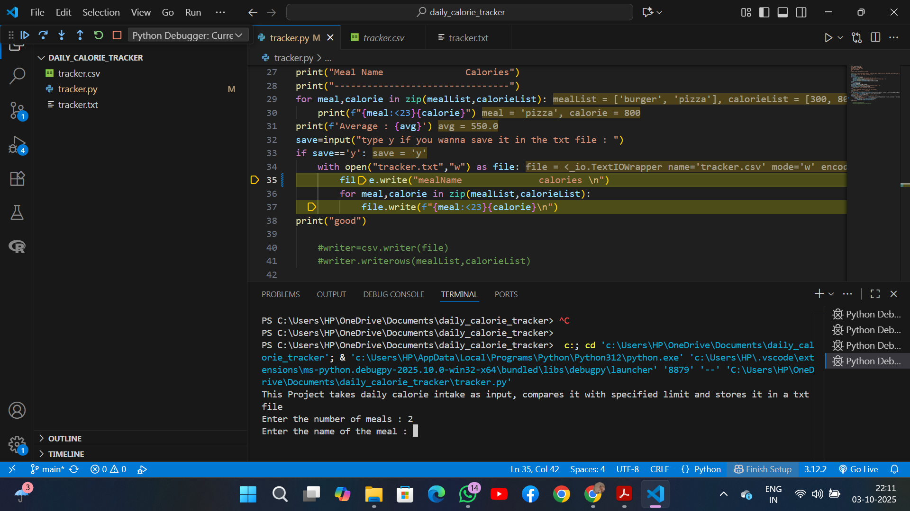
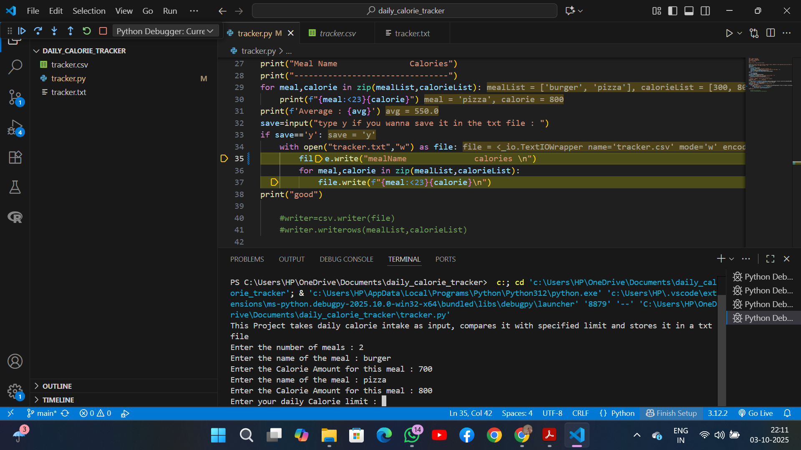
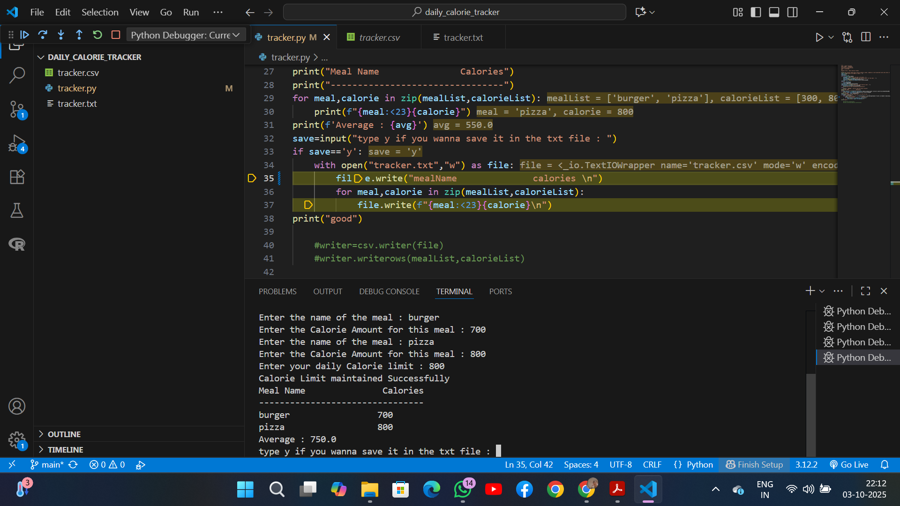
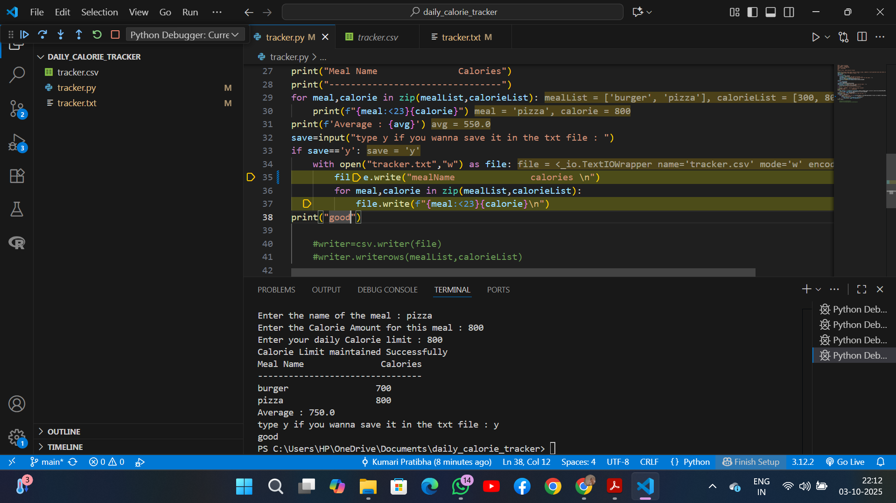

This project takes user input and predicts if the calorie amount taken is in limit or not
for task 1 : it print a welcome message explaining this project in brief

for task 2,3  and 4: it takes input from the user the meal name and the calorie amount for each meal, calculates the average and then compares it with specified calorie limit and prints
suitable message accordingly 

for taske 5 and 6 : it print the calorie list along with the meal name
and asks the user if they wanna store the data in a txt file
if yes, then it pushes the data into a tracker.txt file

